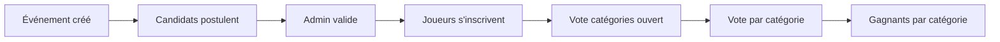
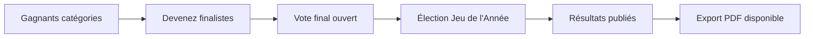

# 🏆 GameCrown - Élection du Jeu de l'Année

<div align="center">


**Plateforme d'élection professionnelle pour désigner le meilleur jeu vidéo de l'année**

*Projet SAE - IUT Informatique*

</div>

## 📖 Table des matières
- [🎮 Aperçu](#-aperçu)
- [✨ Fonctionnalités](#-fonctionnalités)
- [🏗️ Architecture](#️-architecture)
- [👥 Rôles utilisateurs](#-rôles-utilisateurs)
- [🗳️ Processus de vote](#️-processus-de-vote)
- [🎨 Interface](#-interface)
- [👨‍💻 Équipe](#-équipe)
- [📄 Licence](#-licence)


## 🎮 Aperçu

GameCrown est une application web complète qui simule un système d'élection professionnel pour l'industrie du jeu vidéo. La plateforme permet d'organiser des votes en deux phases distinctes pour déterminer le **"Jeu de l'Année"** à travers un processus démocratique et structuré.

### 🎯 Objectifs du projet
- Reproduire un système d'élection réaliste pour l'industrie du gaming
- Offrir une expérience immersive aux différents acteurs (joueurs, candidats, administrateurs)
- Garantir la sécurité et l'intégrité des votes
- Fournir des statistiques détaillées et des résultats exportables


## ✨ Fonctionnalités

### 👤 **Espace Joueur** 🎮
| Fonctionnalité | Description | Icône |
|----------------|-------------|-------|
| 📝 **Inscription événements** | S'inscrire aux événements de vote | `fas fa-calendar-plus` |
| ✅ **Vote catégories** | Voter pour le meilleur jeu par catégorie | `fas fa-vote-yea` |
| 👑 **Vote final** | Élire le jeu de l'année | `fas fa-crown` |
| 📊 **Résultats** | Consulter les résultats détaillés | `fas fa-trophy` |
| 💬 **Commentaires** | Interagir sur les pages des jeux | `fas fa-comments` |
| 🔍 **Salon des jeux** | Explorer tous les jeux en compétition | `fas fa-store` |

### 👑 **Espace Candidat** 🏆
| Fonctionnalité | Description | Icône |
|----------------|-------------|-------|
| 📋 **Profil candidat** | Gérer les informations personnelles | `fas fa-user-tie` |
| 📢 **Campagne** | Publier des messages aux électeurs | `fas fa-bullhorn` |
| 📈 **Statistiques** | Visualiser les performances du jeu | `fas fa-chart-line` |
| 📝 **Postulation** | Postuler aux catégories d'événements | `fas fa-file-signature` |
| 🌐 **Page publique** | Page de présentation du jeu | `fas fa-globe` |

### 🛠️ **Espace Administrateur** 🔧
| Fonctionnalité | Description | Icône |
|----------------|-------------|-------|
| 🗓️ **Gestion événements** | Créer/modifier les événements | `fas fa-calendar-alt` |
| 👥 **Gestion utilisateurs** | Gérer les comptes et permissions | `fas fa-users-cog` |
| ✅ **Validation candidatures** | Approuver/refuser les candidats | `fas fa-check-double` |
| 📋 **Journal sécurité** | Auditer toutes les actions | `fas fa-clipboard-list` |
| 📄 **Export PDF** | Exporter les résultats officiels | `fas fa-file-pdf` |

### 🔒 **Sécurité & Fonctions avancées**
- 🔐 **Authentification sécurisée** avec sessions PHP
- 🛡️ **Protection CSRF** et validation des données
- 📝 **Journalisation complète** (journal_securite)
- 🔄 **Mise à jour automatique** des statuts d'événements
- 📱 **Design responsive** adapté à tous les appareils


## 🏗️ Architecture

### **Backend Stack**
```yaml
Langage: PHP 8.0+
Base de données: MySQL 5.7+
API: PDO pour les requêtes sécurisées
Sessions: Authentification PHP native
```

### **Frontend Stack**
```yaml
CSS Framework: Tailwind CSS 3.4
Icônes: Font Awesome 6
Polices: Google Fonts (Orbitron, Inter)
Design: Glass-morphism moderne
Interactions: JavaScript Vanilla
```


## 👥 Rôles utilisateurs

### **🎮 Joueur (Électeur)**
```
Role: Voter pour les jeux
Accès: 
  - Vote catégories
  - Vote final
  - Salon des jeux
  - Commentaires
Permissions: Lecture intensive, écriture limitée
```

### **👑 Candidat**
```
Role: Représenter un jeu
Accès: 
  - Espace campagne
  - Statistiques détaillées
  - Gestion du profil
  - Postulation aux catégories
Permissions: Lecture/écriture sur son contenu
```

### **🔧 Administrateur**
```
Role: Gestion complète
Accès: 
  - Toutes les fonctionnalités
  - Validation candidatures
  - Gestion des événements
  - Supervision sécurité
Permissions: Lecture/écriture/administration complètes
```

---

## 🗳️ Processus de vote

### **Phase 1 : Vote par Catégories** 📋


### **Phase 2 : Vote Final** 👑



## 🎨 Interface

### **Design Principles**
- **🎨 Style Glass-morphism** avec effets de transparence
- **🎮 Thème gaming** avec accents bleus néon
- **📱 Responsive design** adapté à tous les écrans
- **⚡ Animations subtiles** pour l'expérience utilisateur
- **🎯 Navigation intuitive** avec menu contextualisé

### **Palette de couleurs**
```css
--accent: #00d4ff;     /* Bleu néon principal */
--dark: #0a0a0f;       /* Fond principal */
--light: #ffffff;      /* Texte principal */
--success: #10b981;    /* Succès */
--warning: #f59e0b;    /* Avertissement */
--danger: #ef4444;     /* Danger */
```

### **Composants UI**
- **🃏 Cartes en verre** avec bordures lumineuses
- **🎪 Badges colorés** pour les statuts
- **📊 Graphiques dynamiques** pour les statistiques
- **💬 Système de commentaires** avec badges de rôle
- **🔘 Boutons interactifs** avec effets hover

### **Compétences développées**
```yaml
Développement Web: Full-stack PHP/MySQL
UI/UX Design: Design de glassmorphism / effet de verre
Base de données: Modélisation relationnelle
Collaboration: Gestion de projet en équipe
```

---

## 📄 Licence

<div align="center">

### **Projet Académique - SAE IUT**

© 2025 Malek, Tristan, Axel - Tous droits réservés

*Ce projet a été développé dans le cadre d'une Situation d'Apprentissage et d'Évaluation (SAE) à l'IUT.*
</div>
